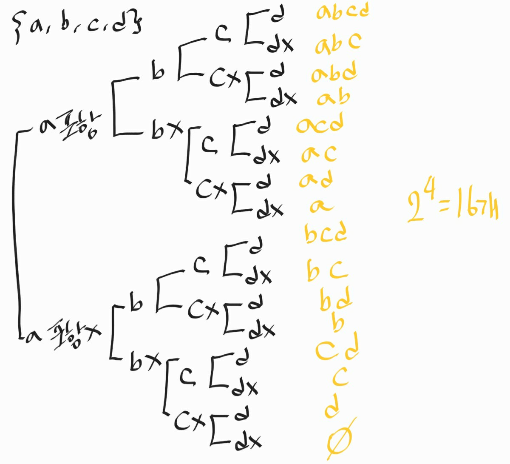

# Algorithm with Math

> 1. GCD / LCM (최대공약수, 최소공배수)
> 2. 순열 / 조합
> 3. 부분 집합 / 멱집합

## 1. GCD/ LCD (최대공약수, 최소공배수)

* 유클리드 호제법

> 조건 : a > b

### GCD, 최대공약수

    static int GDC(int a, int b) {
        
        while(b!=0) {
            int r = a % b;
            a = b;
            b = r;
        }
        return a;
    }

### LCM, 최소 공배수

    static int LCM(int a, int b) {
        return a*b / GCD(a,b);
    }

## 2. 순열 / 조합

### 순열 (permutation)

서로 다른 n 개에서 r 개를 뽑아서 '정렬'하는 경우의 수  
`[1,2]와 [2,1]은 순서가 다르기 때문에, 순열에서는 다른 것으로 카운팅`

    // 6개의 숫자 중 3개의 숫자를 출력할 때 나올 수 있는 경우의 수(중목 x, 순서 O) 111, 222 X
    static void void permutation(int cnt) {
        if (cnt==N) {
            totalCnt++;
            System.out.pintln(Arrays.toString(numbers));
            return;
        }
        // 중요! 순서가 있기 때문에  시작을 1부터, 중복은 없으니 방문 여부 체크
        for (int i = 1; i <= 6; i++) {
            if(isSelected[i]) continue;
            numbers[cnt] = i;
            isSelected[i] = true;
            permutation(cnt+1);
            isSelected[i] = false;
        }
    }   

### 조합 (Combination)

서로 다른 n 개에서 '순서없이' r 개를 뽑는 경우의 수

`[1,2]와 [2,1]을 같은 것으로 취급`

    // 6개의 숫자 중 3개의 숫자를 무작위로 출력하는 경우의 수(중복 X, 순서 X) 111, 222 X
    static void void permutation(int cnt, int start) {
        if (cnt==N) {
            totalCnt++;
            System.out.pintln(Arrays.toString(numbers));
            return;
        }
        // 중요! 순서가 없기 때문에 들어오는 수부터 시작
        // 뽑은 수의 다음(i+1)으로 재귀를 호출하기 때문에 중복체크를 하지않아도 중복 안됨. 
        for (int i = start; i <= 6; i++) {
            numbers[cnt] = i;
            permutation(cnt+1, i+1);
        }
    } 

### 중복 순열

서로 다른 n 개에서 중복이 가능하게 r 개를 뽑아서 정렬하는 경우의 수

`순열과 동일하지만, 중복해서 뽑을 수 있음`

    // 6개 숫자 중 3개의 숫자 출력할 때 나올 수 있는 경우의 수(중목 O, 순서 O) 111, 222 X
    static void void permutation(int cnt) {
        if (cnt==N) {
            totalCnt++;
            System.out.pintln(Arrays.toString(numbers));
            return;
        }
        // 중요! 순서가 있기 때문에  시작을 1부터, 중복은 없으니 방문 여부 체크
        for (int i = 1; i <= 6; i++) {
            numbers[cnt] = i;
            permutation(cnt+1);
        }
    }

### 중복 조합

서로 다른 n 개에서 '순서없이, 중복이 가능'하게 r 개를 뽀는 경우의 수

`조합과 동일하지만, 이미 뽑은 것을 또 뽑을 수 있음`

    // 6개의 숫자 중 3개의 숫자를 무작위로 출력하는 경우의 수(중복 O, 순서 X) 222, 333 O
    static void void permutation(int cnt, int start) {
        if (cnt==N) {
            totalCnt++;
            System.out.pintln(Arrays.toString(numbers));
            return;
        }
        // 중요! 순서가 없기 때문에 들어오는 수부터 시작
        // 뽑은 수의 다음(i+1)으로 재귀를 호출하기 때문에 중복체크를 하지않아도 중복 안됨.
        for (int i = start; i <= 6; i++) {
            numbers[cnt] = i;
            permutation(cnt+1, i);
        }
    }

## 3. 부분 집합/ 멱집합

### 부분 집합 (Subset)

* 공집합을 포함한 모든 원소의 경우의 수를 의미
* {1,2,3} 의 부분 집합은 공집합({}), {1}, {2}, {3}, {1,2}, {1,3}, {2,3}, {1,2,3}
* '조합'을 이용하여 쉽게 풀이

### 멱집합 (Power Set)

* 해당 집합의 모든 부분 집합을 모아둔 것
* {a,b,c,d} 집합의 멱집합을 구하는 방법은 아래와 동일

    static void powerSet(int[] arr, boolean[] visited, int n, int idx) {
        if(idx==n) {
            for (int i = 0; i<n; i++) {
                if(visited[i]) System.out.println(arr[i] + "");
            }
            System.out.println();
            return;
        }

        visited[i] = false;
        powerSet(n+1);
        visited[i] = true;
        powerSet(n+1);
    }